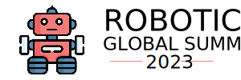

<a name="readme-top"></a>


  <h3><b>README</b></h3>

</div>

# 📗 Table of Contents

- [📗 Table of Contents](#-table-of-contents)
- [📖 Robotics Summit ](#-robotics-summit-)
  - [🛠 Built With ](#-built-with-)
    - [Key Features ](#key-features-)
  - [🚀 Live Demo ](#-live-demo-)
  - [💻 Getting Started ](#-getting-started-)
    - [Setup](#setup)
  - [👥 Authors ](#-authors-)
  - [🔭 Future Features ](#-future-features-)
  - [🤝 Contributing ](#-contributing-)
    - [Issues](#issues)
  - [⭐️ Show your support ](#️-show-your-support-)
  - [🙏 Acknowledgments ](#-acknowledgments-)
  - [📝 License ](#-license-)


# 📖 Robotics Summit <a name="about-project"></a>



**Robotics Summit** is the fisrt module capstone project at Microverse. It's about a fictional event that will happen in 2023 featuring robots.

## 🛠 Built With <a name="built-with"></a>

This website is built with:
- HTML
- CSS
- Javascript

### Key Features <a name="key-features"></a>

- It uses Javascript for showing navigation menus and dynamic content.
- It has various animations on different elements of the page.
- It is responsive. Has a design for mobile and desktop version.


<p align="right">(<a href="#readme-top">back to top</a>)</p>

## 🚀 Live Demo <a name="live-demo"></a>

You can see the Live Demo on the link below:

https://jaimevillegas.github.io/capstone_first_module/


<p align="right">(<a href="#readme-top">back to top</a>)</p>

## 💻 Getting Started <a name="getting-started"></a>

You can clone this repository, create a new branch and add as many improvements as you want.

### Setup

Clone this repository to your desired folder:

```
  cd my-folder
  git clone https://github.com/jaimevillegas/capstone_first_module.git 
```

<p align="right">(<a href="#readme-top">back to top</a>)</p>

## 👥 Authors <a name="authors"></a>

👤 **Jaime Villegas**

- GitHub: [@githubhandle](https://github.com/jaimevillegas)
- Twitter: [@jaimevillegazz](https://twitter.com/JaimeVillegazz)
- LinkedIn: [Villegas0296](https://www.linkedin.com/in/villegas0296/)
- Medium: [@jaimevillegas296](https://medium.com/@jaimevillegas296)

<p align="right">(<a href="#readme-top">back to top</a>)</p>

## 🔭 Future Features <a name="future-features"></a>

- [ ] Add Program Page
- [ ] Add Join Page
- [ ] Add Sponsor Page
- [ ] Add News Page

<p align="right">(<a href="#readme-top">back to top</a>)</p>

## 🤝 Contributing <a name="contributing"></a>

Contributions, issues, and feature requests are welcome!

### Issues

<p align="right">(<a href="#readme-top">back to top</a>)</p>

## ⭐️ Show your support <a name="support"></a>

If you like this project you are welcome to support it!

<p align="right">(<a href="#readme-top">back to top</a>)</p>

## 🙏 Acknowledgments <a name="acknowledgements"></a>

I would like to thank to Microverse on giving me the oportunity to develop my coding skills

<p align="right">(<a href="#readme-top">back to top</a>)</p>

## 📝 License <a name="license"></a>

This project is [MIT](./LICENSE.md) licensed.

<p align="right">(<a href="#readme-top">back to top</a>)</p>
